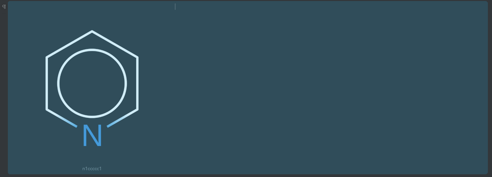
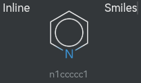

# SiYuan SMILES Renderer

A plugin for SiYuan Note that dynamically generates 2D chemical structure diagrams from SMILES strings using smiles-drawer.

**Features**

* Slash Command Integration: Quickly open the viewer using `/chem`, `/smiles`, or `/insert`.
* Live Interactive Preview: Renders chemical structures in real time as you type or edit SMILES strings.

**Usage**

|         | Block                                    | Inline                                    |
|---------|------------------------------------------|-------------------------------------------|
| Command | /SMILES block                            | /Inline SMILES                            |
| Example |  |  |

* Type `/SMILES block` or `/Inline SMILES ` in any Protyle document block and select your option.
* Input or paste your SMILES string (e.g., `n1ccccc1`, `CC(=O)OC1=CC=CC=C1C(=O)O`).
* Press Enter to insert your SMILES string as png into your notes at the position of your cursor.

## Citation

This project builds upon **smiles-drawer**:

> Probst, D., & Reymond, J.-L. (2018). SmilesDrawer: Parsing and Drawing SMILES-Encoded Molecular Structures Using Client-Side JavaScript. _Journal of Chemical Information and Modeling_, 58(1), 1–7. DOI: [10.1021/acs.jcim.7b00425](https://doi.org/10.1021/acs.jcim.7b00425)

_Note: Chinese translations in this project were generated using AI._
